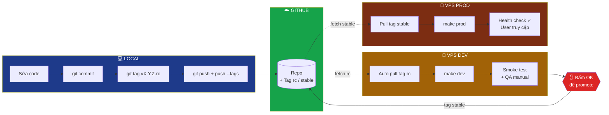

# Quy trình Deploy — Local → Dev → Prod

Tách 2 môi trường: **VPS Dev** test trước → confirm OK → **VPS Prod** đẩy live.

---

## 0. Release nhiều repo + lineage (nguyên tắc generic)

> Áp khi dự án có >1 repo deploy chung, HOẶC môi trường chạy 1 lineage khác `main`.
> **Lệnh/host/path/tên container/domain CỤ THỂ của từng dự án để ở doc deploy RIÊNG của dự án — KHÔNG nhét vào file portable này.**

**Nhiều repo = CÙNG 1 rc:**
- 1 lần release = cùng tag rc trên TẤT CẢ repo liên quan (kể cả repo không đổi code → re-tag cùng commit) → tránh lệch.
- Tính số rc từ REMOTE, không từ local: `git fetch --tags` trước rồi `N = max(rc trên mọi remote) + 1`. Local hay tụt xa sau remote.

**Lineage đang chạy (chống regress):**
- Môi trường (Dev/Prod) có thể chạy 1 nhánh deploy ĐANG TRƯỚC `main`. Kiểm tra tag/commit môi trường đang chạy TRƯỚC khi tag mới.
- Feature build trên nền khác → rebase feature lên đúng lineage đang chạy rồi mới tag (`git rebase --onto <lineage> <fork-point>`), đừng deploy nhánh-tách-từ-main → regress.
- File đánh-số tuần tự (migration…): nếu lineage đích đã thêm số mới → đổi số của mình ra SAU số cao nhất của lineage đích, tránh trùng số.

**Migration an toàn (khi KHÔNG test được DB local):**
- Backup DB trước lệnh phá huỷ (`DROP`/`ALTER`); dùng `IF EXISTS` cho idempotent.
- `INSERT … SELECT` đổ vào cột enum → cast tường minh `(…)::enum_type` (varchar KHÔNG auto-cast → có thể crash boot).
- `ALTER TYPE … ADD VALUE` và việc DÙNG giá trị mới phải tách 2 migration (mỗi file 1 transaction ngầm).
- App auto-migrate lúc boot → migration lỗi = crash-loop; review kỹ vì không có DB local.
- Sau deploy có PWA/service worker → verify phải hard reload / clear SW (tránh kết luận nhầm trên bản cache cũ).

---

## Sơ đồ tổng



---

## 4 Phase

### Phase 1 — LOCAL: commit + tag release candidate

> **Bước commit + push theo skill [commit-github](commit-github.md)** (gate secret/build + message Conventional Commits + vệ sinh nhánh). Skill deploy này tiếp quản TỪ bước tag rc trở đi.

```bash
git status
git add -p
git commit -m "feat: short summary"

git tag v1.3.0-rc.1          # rc = release candidate, đẩy lên DEV trước
git push origin main
git push origin v1.3.0-rc.1
```

**Quy ước tag:**
- `v1.3.0-rc.1` → release candidate, deploy lên **DEV**
- `v1.3.0` → stable, deploy lên **PROD** (chỉ tạo sau khi DEV OK)

---

### Phase 2 — VPS DEV: test môi trường giống prod

```bash
ssh dev@vps-dev
cd /opt/<app>/<infra-repo>
git pull --tags
git checkout v1.3.0-rc.1

make dev                     # docker compose lên stack dev
make health                  # smoke test
```

**Trên DEV cần verify:**
- ✅ Migration chạy không lỗi
- ✅ API `/health` trả OK
- ✅ Login/logout flow chính
- ✅ Feature mới hoạt động đúng spec
- ✅ Không regression feature cũ

> **Data trên DEV:** dùng seed/fake data, KHÔNG dùng data prod.

---

### Phase 3 — GATE: ✋ Bấm OK để promote

Sau khi QA trên DEV pass → tạo **stable tag** từ chính commit của rc:

```bash
# Trên máy local
git checkout v1.3.0-rc.1
git tag v1.3.0               # stable tag, không có hậu tố -rc
git push origin v1.3.0
```

> Ý nghĩa: stable tag = "approved for production". Đây là **cổng phê duyệt** thủ công.

---

### Phase 4 — VPS PROD: deploy live

```bash
ssh prod@vps-prod
cd /opt/<app>/<infra-repo>
git pull --tags
git checkout v1.3.0

make prod                    # pull image + migrate + restart
make health                  # curl /health → {"status":"ok"}
```

**`make prod` làm gì?**
1. `docker compose pull` — kéo image mới
2. `docker compose run migrate` — chạy migration DB
3. `docker compose up -d` — restart api + cron + nginx

---

## So sánh Dev vs Prod

| Thành phần | VPS DEV | VPS PROD |
|------------|---------|----------|
| **Mục đích** | Test rc tag, QA, smoke test | Phục vụ user thật |
| **Tag deploy** | `v1.3.0-rc.1`, `v1.3.0-rc.2`, … | `v1.3.0` (stable) |
| **Data** | Seed / fake data | Data thật, có backup |
| **Domain** | `dev.example.com` | `app.example.com` |
| **TLS** | Self-signed / staging cert | Let's Encrypt prod |
| **Log level** | `debug` | `info` / `warn` |
| **Backup** | Không cần | Daily, off-site |
| **Truy cập** | Internal team | Public users |

---

## Kiến trúc 2 VPS

```
                ┌──────────────┐
                │   GITHUB     │
                │  repo(s) +   │
                │  semver tag  │
                └──────┬───────┘
                       │
          ┌────────────┴────────────┐
          │                         │
          ▼ (tag -rc)               ▼ (tag stable, sau khi OK)
┌──────────────────┐      ┌──────────────────┐
│   VPS DEV        │      │   VPS PROD       │
│                  │      │                  │
│  nginx (staging) │      │  nginx (TLS)     │
│      ↓           │      │      ↓           │
│  api + cron +    │      │  api + cron +    │
│  web (debug)     │      │  web (prod)      │
│      ↓           │      │      ↓           │
│  postgres        │      │  postgres        │
│  (seed data)     │      │  (real data)     │
└──────────────────┘      └──────────────────┘
       ▲                          ▲
       │                          │
   QA test                    User thật
```

---

## Tổng kết flow

| Bước | Nơi chạy | Lệnh | Mục đích |
|------|----------|------|----------|
| 1. Commit code | Local | `git commit` | Lưu thay đổi |
| 2. Tag rc | Local | `git tag v1.3.0-rc.1` | Đánh dấu release candidate |
| 3. Push | Local | `git push --tags` | Đẩy lên GitHub |
| 4. Deploy DEV | VPS Dev | `make dev` | Triển khai môi trường test |
| 5. QA test | VPS Dev | Manual + smoke | Kiểm tra chức năng |
| 6. **✋ Bấm OK** | Local | `git tag v1.3.0` | **Phê duyệt promote prod** |
| 7. Deploy PROD | VPS Prod | `make prod` | Đẩy live cho user |
| 8. Verify | VPS Prod | `make health` | Xác nhận healthy |

**Nguyên tắc vàng:** *"Code không chạy được trên DEV thì không được lên PROD."*
